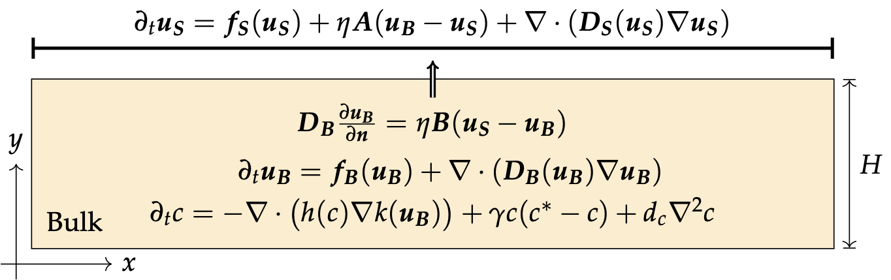
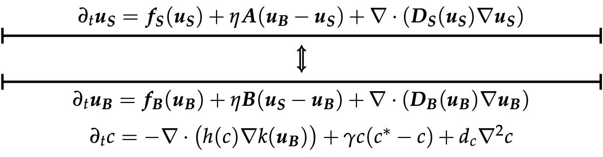

## Summary

This repository contains a Julia code for a bilayer reaction-diffusion-chemotaxis system with two interacting chemical species diffusing through the surface and the bulk and one chemo-attracted species in the bulk. The code includes the 1D-2D version

as well as the 1D-1D version (with an infinitely thin bulk):

And in both cases with zero-flux boundary conditions on the non-interfacial sides.

The reaction-diffusion, chemotaxis and growth functions in the surface and the bulk can be modified in the file `reaction_taxis_growth.jl`. Examples discussed in the article are pre-defined and may serve as a syntax example to define other models.

The scheme is a simple Method of Lines with, a third order advection scheme for the chemotaxis part, a standard  five-point stencil discretisation of the Laplacian (all on a cell centered grid) and using an ODE solver from [DifferentialEquation.jl](https://diffeq.sciml.ai/stable/) for the time discretisation. 

The numerical parameters can be tuned directly in the main script `main.jl`. Running this script will then simulate the system during the desired time and save the parameters, the final value and a video in a new folder. 

*Note: although this script should be relatively fast for common models, the default model in `main.jl` is the meta-stable pseudo-linear model described in the article which may take about 20 minutes to run.*
