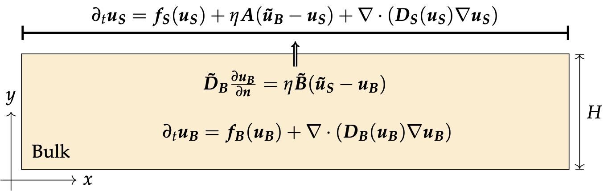
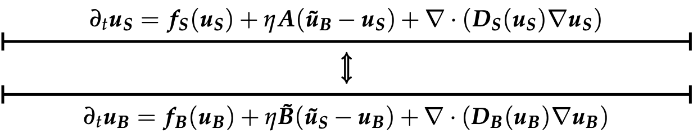

## Summary

This repository contains the code for the preprint 

Diez A., Krause A. L., Maini P. K., Gaffney E. A., Seirin-Lee S., *The effect of coupling on patterning conditions in reaction-cross-diffusion systems with a bilayer geometry*, 2023 

The goal of this article is to investigate the patterning conditions in general bilayer reaction-cross-diffusion systems either in a 1D-surface/2D-bulk situation or in the case of two coupled 1D layers. In these models, the different species are able to diffuse through an inteface via a linear transport law. Depending on the strength of the exchange rates between the two layers, different patterning scenarios are detailed in the article and confronted to numerical simulations which can be reproduced using the code provided in this repository. 

<figure align="center">

<figcaption><em>1D-2D case</em> </figcaption>
</figure>

<figure align="center">

<figcaption><em>1D-1D case</em> </figcaption>
</figure>

The folder `TuringSpace` contains a numerical code to generate the Turing space of a large class of models with respect to arbitrary parameters as well as the various theoretical quantities derived in the article to study the bifurcation curves. Although this code has been written mostly for bilayer systems, it may be of independent interest to compute the Turing space of general monolayer reaction-cross-diffusion systems. 

The folder `BilayerRCD` contains a custom Julia code for the simulation of a 2+3 components bilayer reaction-diffusion-chemotaxis system. 