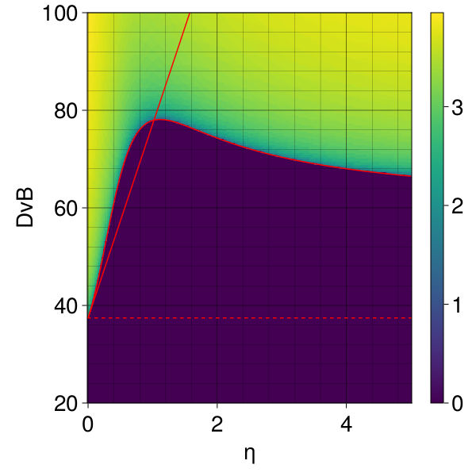

## Summary

This repository contains many scripts to compute numerically and plot the Turing space and critical bifurcation quantities of general reaction-cross-diffusion systems. 

A model can be defined in the script `models.jl` by giving a dictionary of parameters and specifying the reaction and cross-diffusion functions. Pre-defined examples used in the articles are already included and can serve as a syntax example to define other models. The objects to compute and plot can be specified in the script `main.jl`. 

The computation of the Turing space for two arbitrary parameters (generically denoted by η and δ) and an arbitrary set of modes is simply based on the [Routh-Hurwitz criterion](https://en.wikipedia.org/wiki/Routh%E2%80%93Hurwitz_stability_criterion). The computation of the boundary of the instability region (critical curve) is computed numerically using the nonlinear solver [NLsolve.jl](https://github.com/JuliaNLSolvers/NLsolve.jl). In addition, in the case of bilayer systems, the first-order approximation of the critical curve at η=0 is computed using the formula provided in the article. All the computations are done symbolically using the fast package [Symbolics.jl](https://symbolics.juliasymbolics.org/stable/) in order to include a large class of reaction-cross-diffusion mdoels. The plots can be customized thanks to the [Makie.jl](https://docs.makie.org/stable/) interface.  